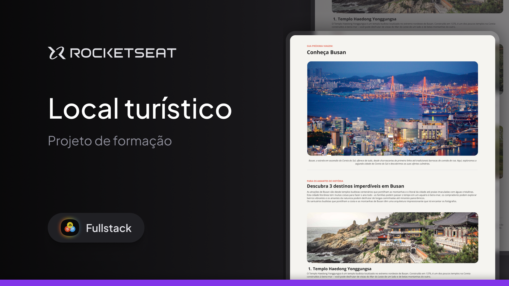

<h1 align="center"> Full-Stack </h1>

 

  

## 🚀 Tecnologias

Esse projeto foi desenvolvido com as seguintes tecnologias:

- HTML e CSS
- Git e Github
- Figma

## 💻 Projeto
Uma página para turismo!
- [Para ver no site](https://lupyeah.github.io/Turismo/)

---

Feito pela Lupy com ajuda da Rocketseat -> [Participe da nossa comunidade!](https://discord.gg/rocketseat)
